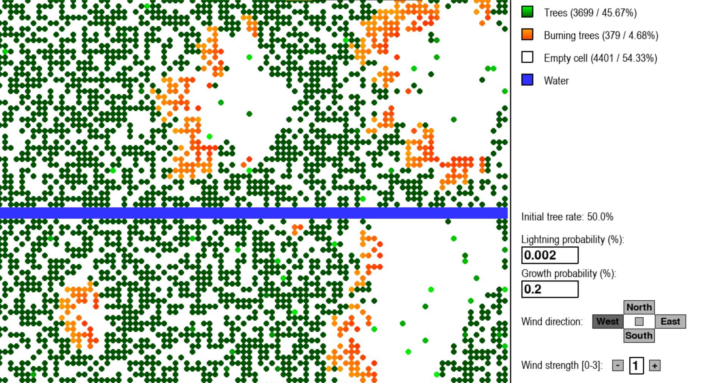

# Forest Fire project

## Introduction

### Planes

The data representation of the forest is implemented by 3 planes:

Plane 0 indicates the presence of a tree: 1-10 = tree age, 0 = empty  
Plane 1 indicates whether a tree is burning: 1-10 = burning time, 0 = not burning
Plane 2 indicates the presence of water: 1 = water, 0 = empty  

The forest is initialized with 'tree_ratio'% of the space occupied by trees of random age.

### Rules

The transition rules are as follows.

1.  A fully burnt tree turns into an empty cell.
2.  A non-burning tree with turns into a burning tree with probability depending on its number of neighbors burning.
3.  A tree with no burning neighbour ignites with a certain probability due to lightning.
4.  An empty space grows a new tree with a certain probability.
5.  A tree grows older at each iteration (1-10).
5.  The older a tree, the more steps it takes to burn.
6.  Fire can't spread in the opposite wind's direction.
7.  The stronger the wind, the further the fire can spread.
8.  Trees can't grow in water: water stops fire, except if the wind is strong enough.

## Files and folders

- grid.py: implements data structures for a plane
- forest.py: implements interactions between the different elements of the forest (trees, fire, wind, water)
- scene.py: handles the display of the simulation with pygame
- input_box.py: implements input boxes
- input_button.py: implements input buttons
- percolation.py: runs a script to compute the percolation threshold
- ./images: folder which contains the images generated

## Run commands

- python3 ./scene.py
- python3 ./percolation.py